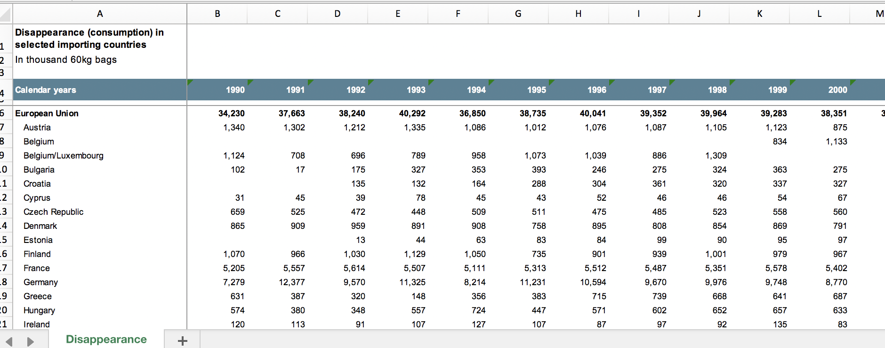
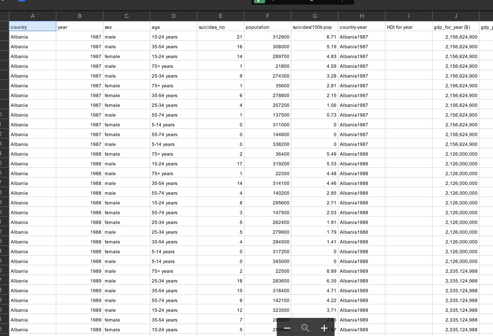

# The Confabulators 

## Team Project

Team Members:
 - Andrew Boring
 - Michael Coates
 - Jin Kim
 - Karen Mosley
 - Srini Mudivarthy

## Hypothesis: 
Increased coffee consumption within a population correlates with increased productivity, as measured in GDP per capita.

Null Hypothesis: There is no correlation between coffee consumption and success as measured above.
 

## Abstract: 
On an individual level, consumption of coffee and its active ingredient, caffeine (a stimulant), is associated with higher levels of “energy” and “productivity”. But in a given population, such as a nation-state, does increased coffee consumption in the larger population itself indicate a higher level of productivity? 

## Approach: 
In this analysis, we use the data from the International Coffee Organization on coffee cconsumption for a select list of industrialized nations from 1990 through 2017 and compare it to GDP data from [insert source] for the same time period. 

### Preliminary Questions: 
 - What is the mean GDP (combined) for the selected nations over the time period?
 - What is the mean coffee consumption (combined) for the selected nations over the time period?
 - What is the mean GDP for individual nations over the time period? 
 - What is the mean coffee consumption for individual nations over the time period?
 - Is there a correlation with other indicators of productivity or success, such as the Human Development Index?
 - What is the standard deviation and something something statistical term something?
 - Is there a "rate of increase" that we can correlate?

In order to determine if the hypothesis is met or not, we will also need to establish which populations did not experience similar increases in GDP output. 

## Data:
We have two primary data files, coffee consumption and gdp.

Coffee Consiumption

GDP Data

Additional data files include Unemployment and an ISO Country Code to Country Name mapping.

## Data Sources:
 - http://www.ico.org/new_historical.asp

## Limitations:
 - The ICO coffee consumption data is measured in terms of "disappearance". Disappearance is measured by adding gross imports, production, and existing inventories, and substracting exports and other non-consumptive use. The resulting "disappearance" is used as a proxy for consumption 

 - The disappearance data consists of western, industrialzed nations within the European Union, Unitied States, and select others such as Tunisia, Russian Federation, Japan, and Norway. The Data lacks information on nations within Asian or African geographic regions, and no developing nations.

 - Disappearance data for most countries ends at 2014, though several continue through to 2017.

 - GDP data was expressed in multiple currencies. Since we're looking for trends and correlations between GDP and consumption, and not specific dollar amounts, we ignored currency and currency calculations. Instead, we used the GDP value for each country as-is.

