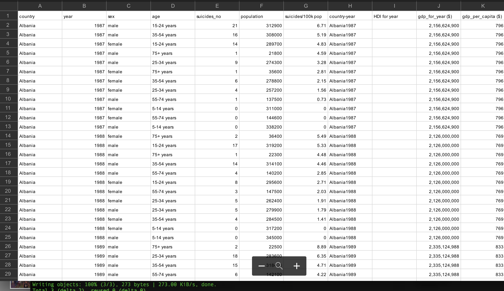

# The Confabulators 

## Team Project

Team Members:
 - Andrew Boring
 - Michael Coats
 - Jin Kim
 - Karen Mosley
 - Srini Mudivarthy

## Hypothesis: 
Increased coffee consumption within a population correlates with increased productivity, as measured in GDP per hour worked.

Null Hypothesis: There is no correlation between coffee consumption and productivity as measured above.
 

## Abstract: 
On an individual level, consumption of coffee and its active ingredient, caffeine (a stimulant), is associated with higher levels of “energy” and “productivity”. But in a given population, such as a nation-state, does increased coffee consumption in the larger population itself indicate a higher level of productivity? 

## Approach: 
In this analysis, we will use the data from the International Coffee Organization on coffee consumption for a select list of industrialized nations from 1990 through 2017 and compare it to GDP data from for the same time period. 

### Preliminary Questions: 
 - What is the coffee consumption trend for the selected nations over the time period?
 - What is the productivity trend for the selected nations over the time period?
 - Which countries drink most coffee? 
 - Which countries show higher productivity compared to other countries?
 - Is there a correlation coffee consumption and productivity?
 - Is there a "rate of increase" that we can correlate?

## Data:
We have two primary data files, coffee consumption and productivity.

Coffee Consumption

Productivity Data

## Data Sources:
 - International Coffee Organization: http://www.ico.org/new_historical.asp
 - OECD: https://data.oecd.org/lprdty/gdp-per-hour-worked.htm

## Limitations:
 - The ICO coffee consumption data is measured in terms of "disappearance". Disappearance is measured by adding gross imports, production, and existing inventories, and subtracting exports and other non-consumptive use. The resulting "disappearance" is used as a proxy for consumption 

 - The disappearance data consists of western, industrialized nations within the European Union, United States, and select others such as Tunisia, Russian Federation, Japan, and Norway. The Data lacks information on nations within Asian or African geographic regions, and no developing nations.

 - Disappearance data for most countries ends at 2014, though several continue through to 2017.

 - GDP data was expressed in multiple currencies. Since we're looking for trends and correlations between GDP and consumption, and not specific dollar amounts, we ignored currency and currency calculations. Instead, we used the GDP value for each country as-is.

